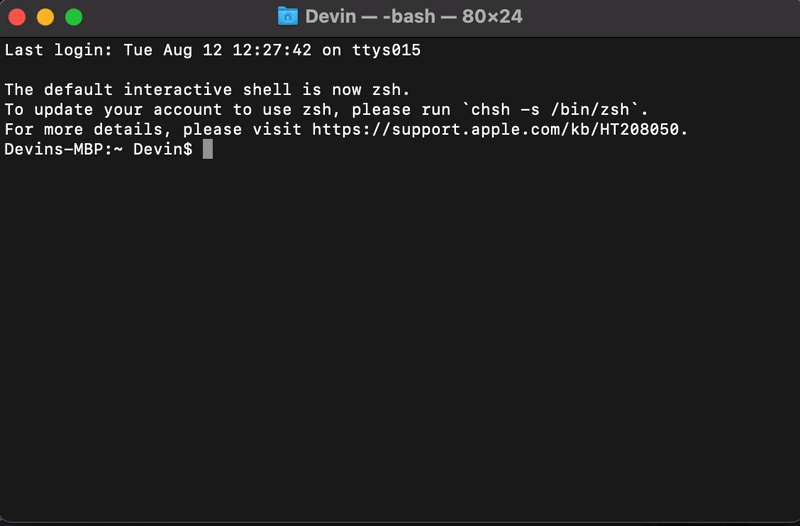

# Trivia CLI Game

A **Python command-line trivia game** powered by the [Open Trivia Database API](https://opentdb.com/) and SQLite.

Fetches, stores and plays trivia questions from multiple categories and difficulties.

Built with **modular Python**, **SQL queries**, and a clean, reusable **database schema**.

---

## Preview



---

## Features
- Pulls trivia data from Open Trivia DB with **category** and **difficulty** filters.
- **Randomized** question adn choice order.
- **Duplicate prevention** when populating the database.
- Persistent SQLite storage for offline play.
- Modular database handling ('db_handler', 'db_schema', 'query').
- CLI menu for category selection, difficulty choice, and question count.

---

## Project Structure

```bash
trivia/
│
├── data_saver.py         # Fetch & stores from API into DB
├── main.py               # CLI game entry point
│
├── models/
│   ├── db_handler.py     # Handles DB saving logic
│   ├── db_schema.py      # Table creation & insert functions
│   ├── play.py           # Game logic & CLI prompts
│   └── query.py          # SQL queries for retrieving data
│
├── trivia.db             # SQLite database file
└── README.md
```
---

## Installation & Setup

1. Clone the repo
```bash
git clone https://github.com/devbiehl/cli-trivia-game.git
cd cli-trivia-game
```
2. Install dependencies 
```bash
pip install -r requirements.txt
```
3. Populate the database
```bash
python3 data_saver.py
```
4. Play the game
```bash
python3 main.py
```

---

## How to Play
1. Choose a **category** (or press Enter for random)
2. Pick a **difficulty** (easy, medium, hard or random)
3. Select the **number of questions**
4. Answer using letter labels or full answer text
5. See if youre correct and try and beat your score!

---

## Technologies Used
- Python 3
- SQLite (with foreign key support)
- Requests (for API calls)
- Open Trivia Database API

---

## License 
MIT LICENSE
